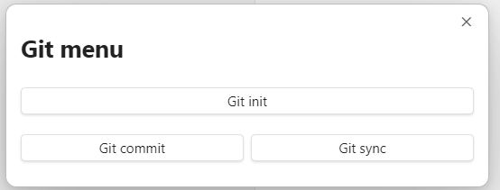
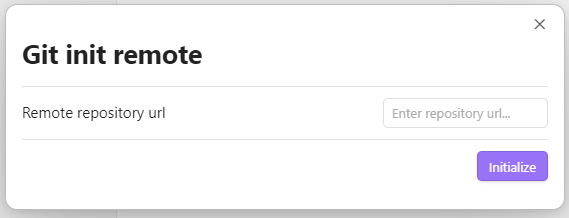

# Obsidian Git Integration Plugin

This is a Git Integration plugin for Obsidian (https://obsidian.md).

Features:
- initialise repository
- specify remote url
- add and commit all files aside from gitignore
- push to remote repository

### Initialise the repository

Create an empty repository on GitHub.

Open the command palette (Ctrl+P on Windows) and search "Open init repository modal".

Paste the remote repository url and click "Initialize" to finish setting up.

### Create a commit

Click "Open git menu" ribbon icon.

The menu will pop up.

Select "Git commit". Alternatively use the command palette and search "Open commit changes modal".

Enter a commit message and click "Commit". This is equivalent to performing `git add .` followed by `git commit -m "<message>"`.

### Sync with remote repository

Select "Git sync" from the git menu. Alternatively use the command palette and search "Sync with remote repository".

Click "Sync" to push new changes to remote.
