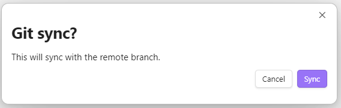

# Obsidian Git Integration Plugin

This is a Git Integration plugin for Obsidian (https://obsidian.md) to allow users to easily backup their obsidian vault on a remote repository.

This plugin works on Windows 10+ and requires Git to be installed in the local system.

- [Open the git menu](#open-the-git-menu)
- [Setup remote repository](#setup-remote-repository)
- [Create a commit](#create-a-commit)
- [Sync with remote repository](#sync-with-remote-repository)

### Open the git menu

Click "Open git menu" ribbon icon.

The menu will pop up, which shows options to init, commit or sync.

### Setup remote repository

Create an empty repository on GitHub.

Open to the git menu and select "Git init" or open the command palette (Ctrl+P on Windows) and search "Open init repository modal".

Paste the remote repository url and click "Initialize" to finish setting up.

### Create a commit

Open to the git menu and select "Git commit" or open the command palette (Ctrl+P on Windows) and search "Open commit changes modal".

Enter a commit message and click "Commit". This is equivalent to performing `git add .` followed by `git commit -m "<message>"`.

### Sync with remote repository

Open to the git menu and select "Git sync" or open the command palette (Ctrl+P on Windows) and search "Sync with remote repository".

Click "Sync" to push new changes to remote.
